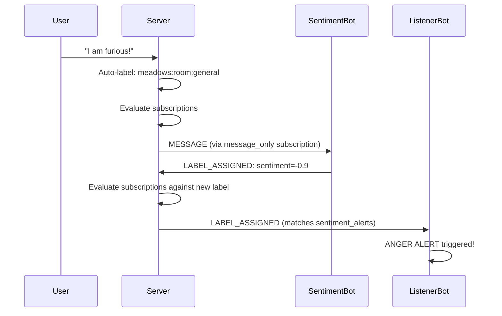
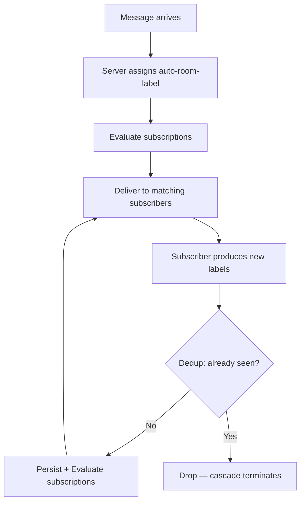
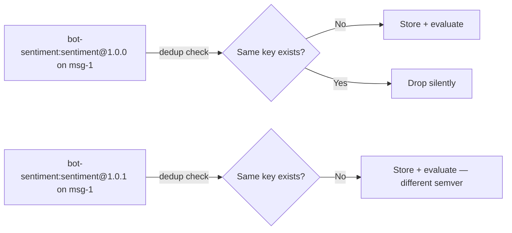
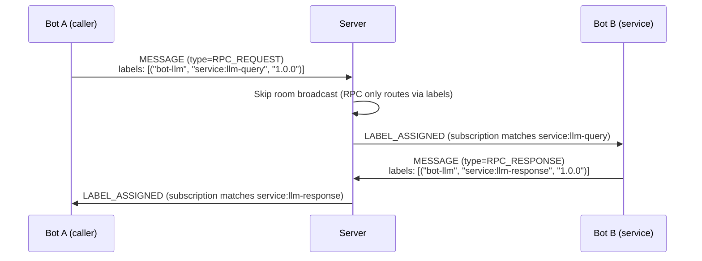
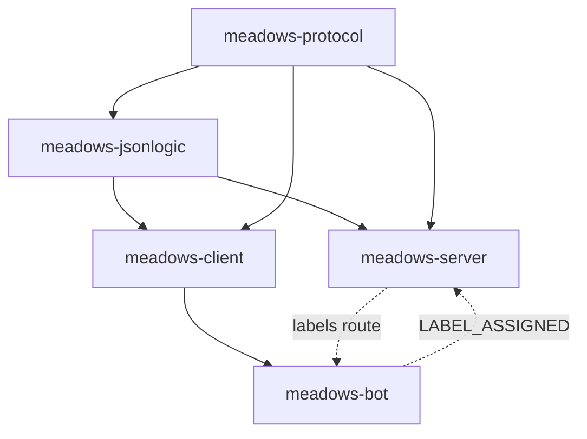
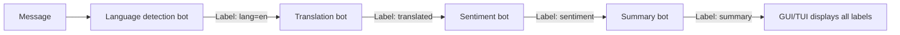
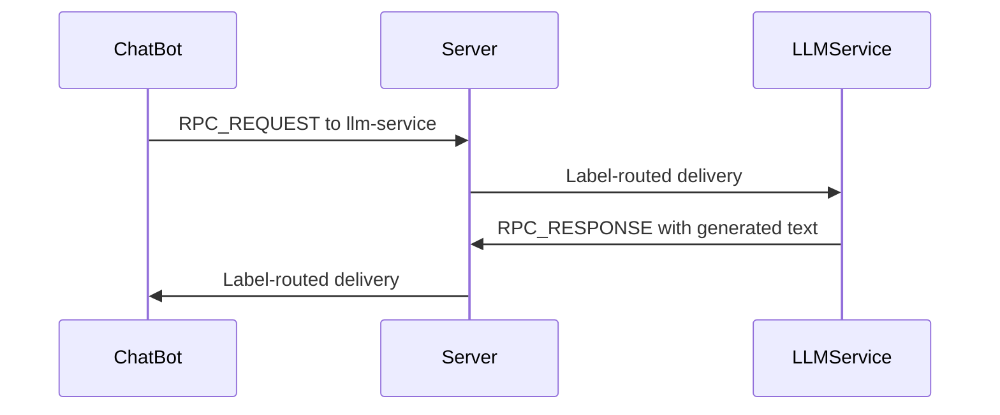

# The Labeling System

MEADOWS has a labeling mechanism that lets bots annotate messages and subscribe to annotations from other bots. Labels are the primary routing structure for bot-to-bot communication — they replace brittle regex patterns with a structured, composable system.

## The simplest case

Every message in MEADOWS gets a label automatically:

```
Label("meadows", "room:general", "1.0.0")
```

This is the **auto-room-label**. It says: "this message is in the `general` room." A bot that wants all messages in a room subscribes to this label. A bot that wants all messages everywhere subscribes with an empty predicate.

That's the whole idea. Labels are facts about messages. Bots subscribe to facts.

## What is a label?

A label is a four-part tuple:

| Field | Purpose | Example |
|-------|---------|---------|
| `origin` | Who produced it | `"bot-sentiment"`, `"meadows"` |
| `label` | What kind of fact | `"sentiment"`, `"room:general"` |
| `semver` | Version of the contract | `"1.0.0"` |
| `metadata` | Optional enrichment | `{"score": -0.9, "tone": "angry"}` |

```python
Label("bot-sentiment", "sentiment", "1.0.0", {"score": -0.9, "tone": "angry"})
```

The first three fields are the **identity**. Metadata is enrichment — two labels with the same `(origin, label, semver)` but different metadata are duplicates. If you want different metadata, bump the semver.

## How routing works



The server is the coordinator. It doesn't know what labels *mean* — it only evaluates predicates against label data and routes to matching subscribers.

## Subscriptions

A subscription is a name + a JSON Logic predicate + a delivery mode:

```json
{
  "name": "sentiment-alerts",
  "predicate": {
    "and": [
      {"regex_match": [{"var": "origin"}, "^bot-sentiment$"]},
      {"regex_match": [{"var": "label"}, "^sentiment$"]},
      {"semver_match": ["^1.0.0", {"var": "semver"}]}
    ]
  },
  "scope": "global",
  "deliver": "label_only"
}
```

### Delivery modes

| Mode | What the subscriber receives |
|------|------------------------------|
| `label_only` | Just the `LABEL_ASSIGNED` event (default, least noise) |
| `message_only` | The full `MESSAGE` event (for bots that need content) |
| `both` | Both events |

### Empty predicate = match everything

```python
bot.register_label_subscription("all_msgs", {}, scope="global", deliver="message_only")
```

This is how a bot that wants to see every message subscribes. The `sentiment_bot` uses this to analyze all messages.

## The cascade

Labels can produce more labels. When a bot emits a `LABEL_ASSIGNED`, the server:

1. Deduplicates against the key `(origin, label, semver, message_id)`
2. Persists the new label in JSONL
3. Evaluates all subscriptions against the new labels
4. Delivers to matched subscribers
5. Those subscribers can produce more labels
6. Repeat until no new labels (fixed point)



The dedup key prevents cycles. There are no depth limits or timeouts — the cascade runs until no new labels appear.

## The dedup key

```
(origin, label, semver, message_id)
```

Metadata is **not** part of the key. Two labels with the same key but different metadata are duplicates. If you need different metadata, bump the semver.



## JSON Logic predicates

Subscriptions use [JSON Logic](https://jsonlogic.com/) with three custom operators:

| Operator | Purpose | Example |
|----------|---------|---------|
| `regex_match(a, b)` | `re.search(b, a)` with case-insensitive | `{"regex_match": [{"var": "origin"}, "^bot-sentiment$"]}` |
| `semver_match(a, b)` | Version b satisfies range a | `{"semver_match": ["^1.0.0", {"var": "semver"}]}` |
| `semver_eq(a, b)` | Exact semver equality | `{"semver_eq": [{"var": "semver"}, "1.0.0"]}` |

All standard JSON Logic operators work too: `==`, `!=`, `>`, `>=`, `<`, `<=`, `and`, `or`, `!`, `var`, `in`, `cat`, `+`, `-`, `*`, `/`, `?:`, `min`, `max`, `count`, `log`.

**Performance:** `regex_match` patterns are compiled once and cached via `lru_cache(4096)` in `meadows-jsonlogic`. Subscriptions are static (registered once, evaluated on every message), so each unique pattern is compiled exactly once for the server's lifetime. Python's internal `re._cache` (512 entries) is a global LRU that evicts under load — the explicit cache survives.

### Example predicates

Match any label from the sentiment bot:

```json
{"regex_match": [{"var": "origin"}, "^bot-sentiment$"]}
```

Match room labels for a specific group:

```json
{"regex_match": [{"var": "label"}, "^room:ops$"]}
```

Match sentiment labels with semver >= 2.0:

```json
{
  "and": [
    {"regex_match": [{"var": "label"}, "^sentiment$"]},
    {"semver_match": [">=2.0.0", {"var": "semver"}]}
  ]
}
```

Access metadata fields:

```json
{"<": [{"var": "metadata.score"}, -0.5]}
```

## Persistence

Labels are stored as separate JSONL records alongside messages:

```
{"type":"user","user_id":"user-1","group_id":"general","content":"I am furious!",...}
{"event":"label_assigned","labels":[{"origin":"bot-sentiment","label":"sentiment","semver":"1.0.0","metadata":{"score":-1.0,"tone":"angry"}}],"target_msg_id":"1783...","applied_by":"bot-sentiment"}
```

RPC requests and responses are both persisted to the same group's JSONL file. The response's `group_id` matches the request's `group_id` — service bots propagate it from the incoming request. This keeps the full RPC conversation in one place:

```
{"type":"rpc_request","content":"add 2 3","labels":[["bot-math-svc","service:math","1.0.0",{"request_id":"req-001"}]],...}
{"type":"rpc_response","content":"5","labels":[["bot-math-svc","service:math-response","1.0.0",{"request_id":"req-001"}]],...}
```

The server never merges `MESSAGE` and `LABEL_ASSIGNED` records — they are distinct. `FETCH_MESSAGES` returns both.

Auto-room-labels are **not** persisted. The room is already in the filename.

## Patterns vs. label subscriptions

MEADOWS has two routing mechanisms. They coexist:

| | Pattern | Label subscription |
|---|---------|-------------------|
| **Matches on** | Message content (regex) | Label fields (JSON Logic) |
| **Input** | Raw text | Structured label data |
| **Use case** | "Messages containing 'urgent'" | "Messages labeled as sentiment by bot-sentiment" |
| **Who registers** | Bots only | Bots and UI clients |
| **Limit** | 50 per bot | Unlimited |
| **Event** | `PATTERN_MATCHED` | `LABEL_ASSIGNED` |

Patterns are the simple path for content matching. Label subscriptions are the structured path for annotation-based routing. A bot can use both.

## RPC via labels

Bots can offer services to other bots using `RPC_REQUEST` and `RPC_RESPONSE` message types. These flow through the same label-routing pipeline:



RPC messages are **not** room-broadcast. They reach subscribers exclusively via label routing. The auto-room-label is not applied to RPC messages.

Correlation uses `request_id` in label metadata — the caller includes a UUID in the request, and the service echoes it back in the response.

## The package structure



| Package | What it does for labels |
|---------|------------------------|
| `meadows-jsonlogic` | Evaluates JSON Logic predicates with custom operators |
| `meadows-protocol` | Declares `Label` model, `EventName` constants, `MessageType` values |
| `meadows-server` | Subscription registry, label evaluation, dedup index, cascade, persistence |
| `meadows-client` | `register_label_subscription()`, `on_label_assigned()`, `call_rpc()`, reconnect replay |
| `meadows-bot` | Thin wrappers + `emit_label()` for the author surface |

## Example bots

### sentiment_bot — a label producer

This bot subscribes to all messages, analyzes sentiment, and produces labels:

```python
class SentimentBot(BaseBot):
    BOT_NAME = "sentiment"

    def __init__(self, **kwargs):
        super().__init__(**kwargs)
        self.client.on(EventName.MESSAGE, self._on_message)

    def _on_message(self, data):
        content = data.get("content", "")
        sentiment = analyze_sentiment(content)
        lbl = Label("bot-sentiment", "sentiment", "1.0.0", sentiment)
        self.emit_label(data["id"], [lbl])

if __name__ == "__main__":
    bot = SentimentBot()
    bot.register_label_subscription("all_msgs", {}, scope="global", deliver="message_only")
    bot.connect()
```

### label_listener_bot — a label consumer

This bot subscribes to sentiment labels and alerts on angry messages:

```python
class LabelListenerBot(BaseBot):
    BOT_NAME = "listener"

    def _on_angry_sentiment(self, data):
        for lbl in data.get("labels", []):
            if lbl["metadata"]["tone"] == "angry":
                self.log(f"ANGER ALERT! score={lbl['metadata']['score']}")

if __name__ == "__main__":
    bot = LabelListenerBot()
    bot.register_label_subscription(
        "sentiment_alerts",
        {
            "and": [
                {"regex_match": [{"var": "origin"}, "^bot-sentiment$"]},
                {"regex_match": [{"var": "label"}, "^sentiment$"]},
                {"semver_match": ["^1.0.0", {"var": "semver"}]},
            ]
        },
        scope="global",
        deliver="label_only",
    )
    bot.on_label_assigned("sentiment_alerts")(bot._on_angry_sentiment)
    bot.connect()
```

### Running them together

```bash
# Terminal 1 — server
cd meadows-server && uv run python -m meadows.server

# Terminal 2 — sentiment bot
cd meadows-bot && MEADOWS_SERVER_URL=http://localhost:8080 \
  MEADOWS_JWT_TOKEN=<token> uv run python -m meadows.bot.examples.sentiment_bot

# Terminal 3 — listener bot
cd meadows-bot && MEADOWS_SERVER_URL=http://localhost:8080 \
  MEADOWS_JWT_TOKEN=<token> uv run python -m meadows.bot.examples.label_listener_bot

# Send a message
curl -X POST http://localhost:8080/r/general \
  -H "Authorization: Bearer <user-token>" \
  -H "Content-Type: application/json" \
  -d '{"content":"I am furious about this!"}'
```

Listener output:

```
[INFO] [listener] RECEIVED LABEL_ASSIGNED: 1 labels for msg 1783...
[INFO] [listener] ANGER ALERT on msg 1783...: score=-1.0, tone=angry
```

### echo_service_bot — a minimal RPC service

This bot offers an echo service via RPC. It subscribes to its service label and responds to requests:

```python
class EchoServiceBot(BaseBot):
    BOT_NAME = "echo-svc"

    def __init__(self, **kwargs):
        super().__init__(**kwargs)
        self.client.on(EventName.MESSAGE, self._on_rpc_request)

    def _on_rpc_request(self, data):
        if data.get("type") != MessageType.RPC_REQUEST.value:
            return
        # Extract request_id from label metadata
        request_id = None
        for lbl in data.get("labels", []):
            if len(lbl) > 3 and isinstance(lbl[3], dict):
                request_id = lbl[3].get("request_id")
                if request_id:
                    break
        # Echo back with same request_id, persisted to the same group
        self.emit_rpc_response(
            request_id=request_id,
            content=f"Echo: {data['content']}",
            origin="bot-echo-svc",
            service_label="service:echo-response",
            group_id=data.get("group_id", "general"),
        )

if __name__ == "__main__":
    bot = EchoServiceBot()
    bot.register_label_subscription(
        "echo-service",
        {"and": [
            {"regex_match": [{"var": "label"}, "^service:echo$"]},
            {"semver_match": ["^1.0.0", {"var": "semver"}]},
        ]},
        scope="global",
        deliver="message_only",
    )
    bot.connect()
```

### rpc_caller_bot — calling RPC services

This bot calls the echo and math services and displays results:

```python
class RPCCallerBot(BaseBot):
    BOT_NAME = "caller"

    def handle(self, command, args, raw_args, message, thread_context):
        if command == "echo":
            text = self.extract_quoted_string(args)
            # emit_rpc_request returns a request_id for correlation
            request_id = self.emit_rpc_request(
                service_label="service:echo",
                content=text,
                origin="bot-echo-svc",
            )
            return None  # Response arrives asynchronously

    def _on_rpc_response(self, data):
        if data.get("type") != MessageType.RPC_RESPONSE.value:
            return
        # Extract request_id for correlation
        for lbl in data.get("labels", []):
            if len(lbl) > 3 and isinstance(lbl[3], dict):
                request_id = lbl[3].get("request_id")
                self.log(f"Response (req={request_id}): {data['content']}")
```

### call_rpc — async/await for RPC across all clients

`call_rpc` lives on `MeadowClient`, so it's available to bots, TUI, and GUI clients alike. It wraps the fire-and-forget pattern in an async/await:

```python
# In a bot
result = await self.call_rpc("service:math", f"add {content}")

# In a TUI or GUI client (MeadowClient directly)
result = await client.call_rpc("service:math", "add 2 3", origin="bot-math-svc")
```

`call_rpc` is async — it must be called from an async context. The client creates an `asyncio.Future` internally, sends the `RPC_REQUEST`, and resolves the future when the matching `RPC_RESPONSE` arrives. A `TimeoutError` is raised if the service doesn't respond in time.

```python
async def call_rpc(
    self,
    service_label: str,
    content: str,
    *,
    origin: str | None = None,
    semver: str = "1.0.0",
    timeout: float = 30.0,
    group_id: str = "general",
) -> str
```

For bots, `BaseBot.call_rpc` is a thin wrapper that defaults `origin` to `BOT_NAME` and delegates to `self.client.call_rpc`. You can combine `call_rpc` with `on_rpc_response` callbacks — both fire when the response arrives. The future resolves first, then the callback runs.

### Running the RPC example

```bash
# Terminal 1 — server
cd meadows-server && uv run python -m meadows.server

# Terminal 2 — echo service
cd meadows-bot && MEADOWS_SERVER_URL=http://localhost:8080 \
  MEADOWS_JWT_TOKEN=<echo-svc-token> uv run python -m meadows.bot.examples.echo_service_bot

# Terminal 3 — math service
cd meadows-bot && MEADOWS_SERVER_URL=http://localhost:8080 \
  MEADOWS_JWT_TOKEN=<math-svc-token> uv run python -m meadows.bot.examples.math_service_bot

# Terminal 4 — caller bot
cd meadows-bot && MEADOWS_SERVER_URL=http://localhost:8080 \
  MEADOWS_JWT_TOKEN=<caller-token> uv run python -m meadows.bot.examples.rpc_caller_bot

# In the caller's chat:
@caller echo hello world
@caller math add 2 3
@caller math power 2 10
```

Caller output:

```
[INFO] [caller] Sent echo request a1b2c3: hello world
[INFO] [caller] RPC response (req=a1b2c3): Echo: hello world
[INFO] [caller] Sent math request d4e5f6: add 2 3
[INFO] [caller] RPC response (req=d4e5f6): 5
[INFO] [caller] Sent math request g7h8i9: power 2 10
[INFO] [caller] RPC response (req=g7h8i9): 1024
```

### Testing RPC via webhook

You don't need the caller bot to test RPC. Any HTTP client can send RPC requests via the webhook endpoint. The webhook passes through the `type` and `labels` from the request body:

```bash
# Generate tokens (after server restart)
cd meadows-server
CALLER_TOKEN=$(uv run edwh local.bot-jwt --name=caller 2>/dev/null | tail -1)

# Echo RPC
curl -X POST http://127.0.0.1:8080/r/test \
  -H "Authorization: Bearer $CALLER_TOKEN" \
  -H "Content-Type: application/json" \
  -d '{"content":"hello","type":"rpc_request","labels":[["bot-echo-svc","service:echo","1.0.0",{"request_id":"req-001"}]]}'

# Math RPC
curl -X POST http://127.0.0.1:8080/r/test \
  -H "Authorization: Bearer $CALLER_TOKEN" \
  -H "Content-Type: application/json" \
  -d '{"content":"add 2 3","type":"rpc_request","labels":[["bot-math-svc","service:math","1.0.0",{"request_id":"req-002"}]]}'
```

Both request and response are persisted to `test.jsonl`. The response includes the same `request_id` in its label metadata for correlation.

```bash
# Verify persistence
grep "rpc_response" meadows-server/messages/test.jsonl
```

The webhook is the HTTP equivalent of a Socket.IO `MESSAGE` event. The `type` field defaults to `"webhook"` but is overridden to `rpc_request` or `rpc_response` when specified. Labels are passed through to the label-routing pipeline.

## Design intent

### Why labels exist

MEADOWS had a routing problem. Pattern matching (regex on content) is flat — every bot gets what the regex finds, without context, without shared taxonomy. The stats bot registers `".*"` and sees everything. A bot that wants only urgent messages must write its own regex and hope nobody else defines "urgent" differently.

Labels solve this by making annotations first-class routing objects. A bot declares "this message is of kind X" via a label. Other bots subscribe to kind X. The server routes based on labels, not content. The server does not know what labels *mean* — it only evaluates predicates and routes to matching subscribers.

This is the fundamental separation: the server is a coordinator, not a processor. It routes; bots decide.

### Why RPC is labels, not a separate system

RPC (bot-to-bot service calls) could have been a separate mechanism — dedicated events, a separate routing table, a service registry. Instead, it is label routing with a `request_id` in metadata. This is intentional.

A separate RPC system would be privileged — invisible to UI clients, disconnected from the annotation pipeline, harder to debug. By making RPC use the same label-routing mechanism as everything else, we get:

- **Transparency:** a GUI client that subscribes to RPC labels can see which bots are calling which services. No separate debug mode needed.
- **Composability:** a bot that calls the math service, then the LLM service, then the sentiment service — that composition uses the same mechanism as label routing. No new abstractions.
- **Simplicity:** no service registry, no separate routing table, no RPC-specific auth. Just labels and message types.

The service vocabulary (what `service:math` or `service:llm-query` means) is emergent. The routing mechanism is protocol.

### Why `call_rpc` is on the client, not the bot

`call_rpc` lives on `MeadowClient` because any client type should be able to call services — not just bots. A TUI client can call a math service. A GUI client can call an LLM service. A bot can call another bot's service. The async pattern (`await client.call_rpc(...)`) means:

- A slow service does not block the caller
- Multiple RPC calls can run concurrently
- Timeouts are enforced at the transport level, not in bot logic

This is not convenience; it is architectural. It means the platform is a substrate for service composition, not just chat.

### Why emergence over prescription

The platform does not prescribe what bots do. It provides mechanisms (labels, RPC, patterns) and lets bots compose them. A "sentiment service" is not a server feature — it is a bot that subscribes to messages and emits sentiment labels. A "math service" is not a server feature — it is a bot that responds to RPC requests.

The vocabulary is emergent. The mechanism is protocol. This is the deepest design principle: the platform provides the *how* (routing, persistence, auth), and bots provide the *what* (sentiment analysis, math, LLM queries).

### Why a separate package for JSON Logic

Both server and clients need to evaluate predicates. DRY is not optional — duplicating the custom operators in server and client would guarantee they diverge. The `meadows-jsonlogic` package is the single implementation.

### Why the dedup key excludes metadata

Metadata is enrichment, not identity. If metadata were part of the key, a bot producing labels with evolving metadata (`{"score": -0.9}`, then `{"score": -0.9, "tone": "angry"}`) would create new keys each time. The cascade would never converge. Bumping the semver is the explicit contract for "this is a different fact."

### Why append-only

Labels are facts about messages. Facts don't un-happen. If a label's semver is wrong, bump the semver. Deletion adds complexity and breaks the guarantee that a subscriber who saw a label can rely on it existing forever.

### Why JSON Logic, not Python code

Label predicates are JSON Logic rules — boolean expressions over label data. JSON Logic cannot have state, which makes statelessness structurally enforced rather than trusted via sandbox isolation. A bot author writes `{"regex_match": [{"var": "label"}, "^sentiment$"]}` — not Python code that might import the server, access the filesystem, or hang in an infinite loop. The constraint is in the mechanism, not in a policy document.

## Future possibilities

### Rich NLP pipelines

A bot chain where each bot adds a layer of analysis:



Each bot subscribes to the previous bot's labels and produces its own. The cascade handles the pipeline automatically.

### Federated services

A bot offers LLM access as a service via RPC:



The service bot runs on fast hardware. The chat bot runs anywhere. They communicate through labels, never directly.

### UI transparency

A GUI client that subscribes to all labels in its rooms can show humans what the bots see:

```
[alice] I am furious about this!
  └─ [bot-sentiment:sentiment@1.0.0] score=-1.0, tone=angry
  └─ [bot-urgency:urgent@1.0.0] level=high
```

The labeling mechanism is protocol. Transparancy is a UI responsibility. The server doesn't force it — the client chooses what to show.

### Form submissions

Forms are implemented via labels. The label `("meadows", "interactive-form", "1.0.0")` declares "this message contains an interactive element." The payload stays opaque — the system doesn't understand what a "form" is.

When a bot sends a form via `send_form()`, the message carries:
- The `interactive-form` label (system signal for rendering)
- The `answer_label` in `metadata['meadows']['form_handling']` (for routing responses)

When a user submits the form, the frontend creates a `FORM_SUBMISSION` message with the `answer_label` as a label. Any bot subscribed to that label receives the submission. This is message-based routing — the form creator is not necessarily the response handler.

See [Interactive Forms](../reference/forms.md) for the full reference.

### Temporal analysis

Labels can be produced on old messages. A bot processing months of history can label old messages with sentiment scores. Subscribers that care about historical analysis receive those labels. The dedup key uses `message_id`, so re-processing the same message with the same label is idempotent.
