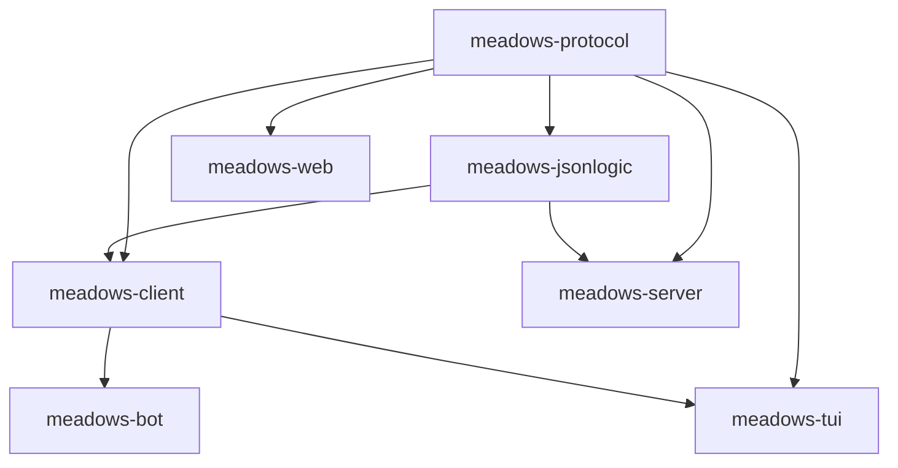

# Architecture Overview

MEADOWS follows a **protocol-first architecture** with strict dependency boundaries. This is not accidental — it is the result of a specific philosophy about what a platform should be.

## Philosophy

### The platform is a substrate, not a framework

MEADOWS does not tell bots what to do. It provides mechanisms — labels for routing, RPC for service calls, patterns for content matching — and lets bots compose them. A "sentiment service" is not a server feature; it is a bot that subscribes to messages and emits sentiment labels. A "math service" is not a server feature; it is a bot that responds to RPC requests. The vocabulary is emergent. The mechanism is protocol.

This is the deepest design principle: the platform provides the *how* (routing, persistence, auth), and bots provide the *what* (sentiment analysis, math, LLM queries). The separation is what makes a second frontend, an alternative server, or a federating layer possible without reading the whole codebase.

### Mechanism is protocol, vocabulary is domain

The test for what belongs in `meadows-protocol`: does the server need this fact for its structural job (routing, storing, generating, notifying)? If yes, and the meaning is irrelevant to the mechanism — it belongs in protocol. If the server only relays it untouched — it belongs in domain.

**Labels** are mechanism: the server routes on `(origin, label, semver)`. What `sentiment` or `service:math` *means* is emergent between bots and users. **RPC** is mechanism: the server routes `RPC_REQUEST` to label subscribers. What a "math service" or "LLM query" *does* is domain. **Message types** are mechanism: `USER`, `BOT`, `RPC_REQUEST`, `RPC_RESPONSE`. The content of those messages is opaque.

### Emergence over prescription

The platform does not prescribe what bots do. It provides mechanisms and lets bots compose them. A bot that calls the math service, then the LLM service, then the sentiment service — that composition is not a platform feature. It is a bot author's decision. The platform enables it; the bot defines it.

This is why `call_rpc` is on `MeadowClient`, not `BaseBot`. Any client — bot, TUI, GUI — can call any service. The service vocabulary is emergent; the routing mechanism is protocol.

### The docent test

Every piece of documentation, every SDK surface, every error message must pass the docent test: can a Dutch teacher (groep 6), together with an AI, use this to build a working bot without reading the source code? If the answer is no, the documentation is not done.

## Dependency graph



## The six packages

### meadows-protocol

Pure declarations. Pydantic models, enums, constants. **Zero behavior.** This is the single source of truth for all shared types.

- `envelope.py` — `Message` model, `MessageType` enum
- `events.py` — `EventName` constants (closed set of Socket.IO events)
- `jwt.py` — `JWTClaims` model, `JWTRole`, `build_claims()` helper
- `permissions.py` — `AVAILABLE_PERMISSIONS`
- `labels.py` — `Label` model `(origin, name, version, metadata?)`
- `codec.py` — reference encoder/decoder

### meadows-jsonlogic

JSON Logic evaluator with custom operators (`regex_match`, `semver_match`, `semver_eq`). Single implementation shared by server and client — DRY.

### meadows-client

Client-side Socket.IO transport. Connect, reconnect, JWT handshake, label subscriptions, `call_rpc()`. Used by both `meadows-bot` and `meadows-tui`.

### meadows-bot

Bot SDK with `BaseBot`, `LLMBot`, and ready-to-use bots. The bot-author-facing package.

### meadows-server

The coordination hub. Socket.IO server, JWT authentication, message persistence, group management, pattern matching, label subscription evaluation, dedup index, RPC routing, rate limiting.

### meadows-web

Dumb HTTP host. Serves `index.html` and static assets. No Socket.IO, no auth, no domain logic. The browser is the real client.

### meadows-tui

Terminal UI client built with Textual. Connects via `meadows-client`.

## Microservices, but for conversation

MEADOWS is a microservices architecture. Each bot is an independent service with its own process, its own identity, and its own lifecycle. The server is a message broker. The protocol is the contract. This is familiar territory for anyone who has built distributed systems.

But MEADOWS does something that traditional microservices don't: **multiple independent services participate in a shared, human-visible conversation, with full context on every message.**

### How this differs from regular microservices

In a typical microservices system, services communicate behind the scenes. An API gateway receives a request, fans it out to internal services, aggregates the results, and returns a single response to the user. The user sees one response. The services don't see each other. There is no shared conversation.

In MEADOWS:

- **The conversation is the message bus.** Every message in a group is visible to every participant — human or bot. A bot that subscribes to a room label receives the same messages that humans see. This is not request-response; it is a shared, persistent, multi-party context.

- **Bots respond in context.** Each bot receives the full message history (up to its context limit). When a user asks "what did the sentiment bot say about that last message?", the bot can look at the thread and answer. This is not a stateless RPC call — it is a participant in an ongoing conversation.

- **Multiple bots react independently to the same event.** When a user sends a message, the sentiment bot might label it, the stats bot might log it, the echo bot might reply, and a label-listener bot might trigger an alert. Each bot makes its own decision based on its own subscription. There is no orchestrator. There is no fan-out gateway. The server evaluates label subscriptions and delivers to whoever matches.

- **Humans and bots are peers.** A human can @mention a bot. A bot can @mention a human. A bot can reply to another bot's message. A form submission from a human is routed to bots via the same label mechanism that routes bot-to-bot RPC. The conversation is the substrate; the participants are interchangeable.

### What this enables

This architecture makes possible things that traditional chatbots and traditional microservices cannot do:

**Multi-agent collaboration.** A teacher asks a question. Bot-A (LLM) generates an answer. Bot-B (fact-checker) subscribes to LLM-response labels and verifies the answer. Bot-C (sentiment) monitors the teacher's reaction. Bot-D (summarizer) waits for the conversation to end and produces a summary. Each bot is independent. Each subscribes to what it cares about. The teacher sees the whole interaction.

**Shared context without central coordination.** There is no orchestrator that says "first call the LLM, then call the fact-checker." Each bot decides for itself based on the labels and messages it receives. The platform provides the routing; the bots provide the logic. This is emergent behavior, not choreographed workflow.

**Progressive automation.** Start with one bot (echo). Add a second (sentiment). Add a third (forms). Each bot is independently deployable, independently testable, independently replaceable. The platform doesn't change. The conversation grows.

**Federation-ready.** Because the protocol is explicit and the server is an object with an explicit lifecycle, a second server can be built that speaks the same protocol. Bots don't know or care which server they're connected to. The conversation is the contract; the implementation is replaceable.

### Bots run anywhere

A bot is a Socket.IO client with a JWT. That's the entire deployment contract. It connects to the server over WebSocket, authenticates, and starts receiving messages. There is no SDK to install, no framework to run, no container to manage. A bot can be:

- A Python script on a laptop
- A serverless function in the cloud
- A Docker container on a Raspberry Pi
- A shared hosting CGI script
- An AI-generated one-liner that a teacher runs during a hackathon

The bot doesn't need a public IP address. It doesn't need a web server. It doesn't need to accept incoming connections. It connects *out* to the server, just like a browser does. NAT, firewalls, and VPNs are irrelevant — the connection is outbound.

This dramatically reduces hosting complexity. Traditional microservices need load balancers, service discovery, health checks, container orchestration. A MEADOWS bot needs: a process, a JWT, and a network path to the server. That's it.

### Centralized LLM access via RPC

One of the most powerful patterns enabled by this architecture is **centralized LLM access through RPC**. An LLM service bot runs once — on a machine with the right hardware, the right API keys, the right rate limits — and exposes its functionality as a label-based service.

Any other bot can call it:

```python
# In any bot — no API key, no GPU, no networking details
result = await self.call_rpc("service:llm-query", prompt)
```

The calling bot doesn't know or care:
- Which LLM is running (GPT, Llama, Mistral)
- Where it's hosted (local GPU, cloud API, shared server)
- How the authentication works (the service bot handles that)
- What the rate limits are (the service bot enforces them)
- How to handle retries, timeouts, and fallbacks (the client library handles that)

This means a bot written by a teacher during a hackathon can use LLM capabilities without managing API keys, without understanding HTTP round-trips, without handling streaming responses, and without paying for their own GPU. The LLM service is a shared resource. The bot author writes `result = await self.call_rpc(...)` and gets back a string.

The same pattern applies to any expensive or centralized resource: database access, external API calls, cryptographic operations, video processing. The service bot runs where the resource is. The calling bot runs wherever it wants. The protocol connects them.

### The key insight

Traditional microservices: **services talk to each other, the user sees one result.**

MEADOWS: **services participate in a shared conversation, the user sees all of them.**

The conversation is not a side effect of the architecture. It *is* the architecture. The message is the unit of work. The label is the routing key. The subscription is the contract. And the human is not an API consumer — they are a participant in the same room as the bots.

1. **Hub is an object** — no module-level `sio` or state. `Hub()` is instantiated, wrapped, testable.
2. **Single chokepoint emit** — all client-bound frames pass through `hub.emit_frame()` which validates against protocol.
3. **Protocol is the only sibling dependency** — server never imports from bot/client, and vice versa.
4. **PEP 420 namespace** — no `src/meadows/__init__.py` anywhere.

See [Design Principles](design-principles.md) for the full set of architectural invariants.
