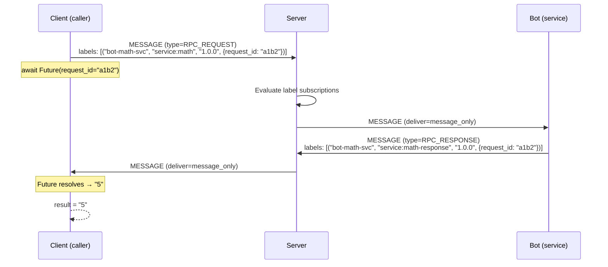

# meadows-client

> Client-side Socket.IO transport for MEADOWS: connect, reconnect, JWT handshake.
> No domain logic — shared by `meadows-bot` and future non-browser clients.

**Repository:** [github.com/remcoboerma/meadows-client](https://github.com/remcoboerma/meadows-client)

## Overview

`meadows-client` wraps `python-socketio.AsyncClient` with MEADOWS-specific concerns:

- JWT handshake on `/chat` namespace connect
- Auto-reconnect (delegated to socketio)
- `send_message()` constructs a valid protocol `Message` before emitting
- `on(event, handler)` for user-registered handlers
- `emit(event, data)` escape hatch for non-message events
- `register_label_subscription()` / `unregister_label_subscription()` for label routing
- `on_label_assigned()` callback registration for subscription matches
- `call_rpc()` — async RPC via labels (send request, await response)

## Install

```bash
cd meadows-client
uv pip install -e .
```

## Test

```bash
uv run pytest -q
```

## Usage

### Pre-signed JWT (recommended)

```python
from meadows.client import MeadowClient
from meadows.protocol import EventName, JWTRole, build_claims

client = MeadowClient(
    server_url="http://localhost:8080",
    claims=build_claims(name="alice", role=JWTRole.USER),
    token="<pre-signed-jwt>",
)

client.on(EventName.MESSAGE, lambda data: print("got:", data))

await client.connect()
await client.send_message(content="hello world", group_id="general")
```

### Raw signing key (local dev / TUI only)

```python
client = MeadowClient(
    server_url="http://localhost:8080",
    claims=build_claims(name="alice", role=JWTRole.USER),
    jwt_secret=b"<shared key bytes>",
)
```

## Protocol contract

This client never sends a frame that violates `meadows.protocol`. The `send_message()` method constructs a valid `Message` envelope before emitting, so the server-side chokepoint never sees an invalid frame from us.

## Label subscriptions

```python
# Subscribe to labels matching a JSON Logic predicate
client.register_label_subscription(
    "sentiment-alerts",
    {"regex_match": [{"var": "label"}, "^sentiment$"]},
    scope="global",
    deliver="label_only",
)

# Handle matched labels
client.on_label_assigned("sentiment-alerts")(lambda data: print(data))
```

Subscriptions are replayed on reconnect.

## RPC via labels

```python
# Send an RPC request and await the response (async)
result = await client.call_rpc("service:math", "add 2 3", origin="bot-math-svc")
```

`call_rpc` creates an `RPC_REQUEST` message, routes it via label subscriptions, and resolves when the matching `RPC_RESPONSE` arrives. Raises `asyncio.TimeoutError` on timeout.

### Schema



### Demo: concurrent calls

Multiple `call_rpc` calls run independently — a slow service doesn't block other calls:

```python
import asyncio

async def demo():
    # Both calls start immediately
    task_a = asyncio.create_task(client.call_rpc("service:math", "add 1 1", origin="bot-math-svc"))
    task_b = asyncio.create_task(client.call_rpc("service:llm", "summarize hello world", origin="bot-llm"))

    # They resolve independently — task_b doesn't wait for task_a
    result_a = await task_a  # "2"
    result_b = await task_b  # "Hello world is a greeting..."
```

### API

```python
async def call_rpc(
    self,
    service_label: str,      # Label to route to (e.g. "service:math")
    content: str,            # Request payload
    *,
    origin: str | None = None,  # Label origin (defaults to caller identity)
    semver: str = "1.0.0",   # Label semver
    timeout: float = 30.0,   # Seconds before TimeoutError
    group_id: str = "general",  # Group for persistence
) -> str                     # Response content
```
