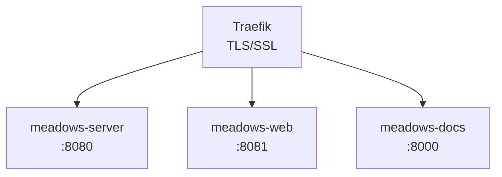

# Docker

Each MEADOWS package has its own `Dockerfile` and `docker-compose.yml` for independent deployment.

## Production architecture



## Server deployment

```bash
cd meadows-server

# Set up environment
uv run edwh local.setup

# Build and start
docker compose up -d
```

The server's `docker-compose.yml` includes Traefik labels for TLS termination.

## Web deployment

```bash
cd meadows-web

# Build the template first
uv run python -m meadows.web.build

# Start
docker compose up -d
```

## Docs deployment

```bash
cd meadows-docs

# Set up environment
uv run edwh local.setup

# Build static site
uv run edwh local.build

# Start production server
docker compose up -d server
```

## Dockerfiles explained

Each package has up to three Dockerfiles:

| File | Purpose | Base image |
|---|---|---|
| `Dockerfile` | Development (mkdocs serve, dev server) | `edwhale-3.13` |
| `Dockerfile.builder` | Build static artifacts | `edwhale-3.13` |
| `Dockerfile.server` | Production (gunicorn, static file serving) | `edwhale-3.13` |

All use `educationwarehouse/edwhale-3.13:latest` as the base image, which includes `uvenv` for dependency management.

## Traefik labels

Production services are exposed via Traefik with automatic TLS:

```yaml
labels:
  - "traefik.enable=true"
  - "traefik.http.routers.${NAME_SERVICE}-secure.rule=Host(`${HOSTINGDOMAIN}`)"
  - "traefik.http.routers.${NAME_SERVICE}-secure.tls=true"
  - "traefik.http.routers.${NAME_SERVICE}-secure.entrypoints=web-secured"
  - "traefik.http.routers.${NAME_SERVICE}-secure.tls.certresolver=letsencrypt"
  - "traefik.docker.network=broker"
```

## Network

All production services connect to the shared `broker` network:

```yaml
networks:
  broker:
    name: broker
    external: true
```
