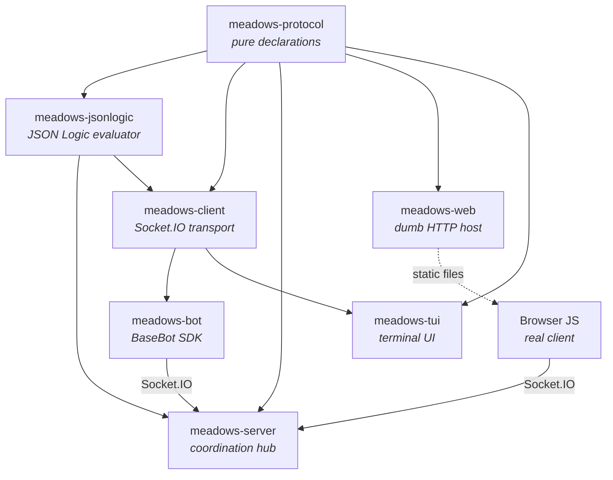

# MEADOWS Documentation

**MEADOWS** = *MEADOWS Enables Agentic Dialogue, Orchestrating a Web of Sense*

Named after Donella Meadows (systems thinking). An open-source Socket.IO orchestration server for AI-facilitated group conversations, hackathon education, and multi-bot simulations.

## What is MEADOWS?

MEADOWS is a modular chat platform built around a **protocol-first architecture**. Six independent Python packages share a common namespace (`meadows.*`) but are developed, tested, and deployed separately.

**Key features:**

- **Group chat** with Socket.IO real-time messaging
- **Bot SDK** — build working bots in minutes, not hours
- **Protocol-driven** — the protocol is explicit, not implicit
- **Multi-client** — web UI, terminal TUI, and bot clients
- **Hackathon-friendly** — designed for rapid iteration and education

## Architecture at a glance

- **`meadows-protocol`** — pure declarations (Pydantic models, enums, constants). Zero behavior, zero dependencies beyond `pydantic`.
- **`meadows-jsonlogic`** — JSON Logic evaluator with custom operators (`regex_match`, `semver_match`, `semver_eq`). Shared by server and client.
- **`meadows-client`** — client-side Socket.IO transport: connect, reconnect, JWT handshake, label subscriptions.
- **`meadows-bot`** — bot SDK with `BaseBot`, `LLMBot`, `send_form()`, `call_rpc()`, and ready-to-use bots.
- **`meadows-server`** — the coordination hub: Socket.IO server, JWT auth, persistence, label evaluation, RPC routing.
- **`meadows-web`** — dumb HTTP host serving the browser-based chat UI. No Socket.IO, no auth.
- **`meadows-tui`** — terminal UI client built with Textual.

## How it works

- **Labels** — the routing mechanism. Bots subscribe to label patterns via JSON Logic predicates; the server evaluates and delivers. [Labeling System](architecture/labeling.md)
- **RPC** — bot-to-bot service calls via labels. A math service, an LLM proxy, a database — any bot can expose functionality. [Client Package](client/index.md)
- **Forms** — interactive HTML sent by bots, submitted by users, routed to any subscribed bot via labels. [Interactive Forms](reference/forms.md)
- **Microservices** — each bot is an independent service. The conversation is the message bus. Humans and bots are peers. [Architecture Overview](architecture/overview.md)

## Quick links

| I want to... | Go to |
|---|---|
| Get started quickly | [Quickstart](getting-started.md) |
| Understand the architecture | [Architecture Overview](architecture/overview.md) |
| Write a bot | [Bot Package](bot/index.md) |
| Send interactive forms | [Interactive Forms](reference/forms.md) |
| Run the server | [Server Package](server/index.md) |
| Deploy with Docker | [Docker](development/docker.md) |
| Contribute code | [Contributing](development/contributing.md) |

## License

Open source — see the repository for license details.
