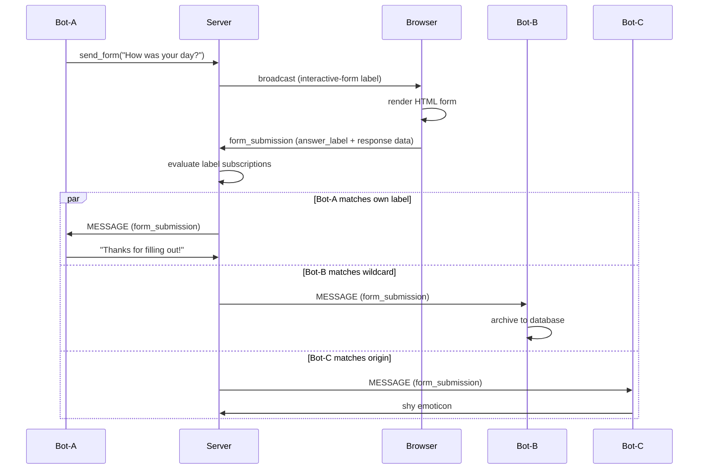

# Interactive Forms

> Forms let bots send interactive HTML to users. When a user fills and submits a form, the response is routed to any bot that subscribes to the matching label. This is message-based routing — not RPC.

## How it works



**Key insight:** the bot that creates the form is not necessarily the bot that processes the response. Any bot subscribed to a matching label receives the submission.

## Sending a form

```python
from meadows.bot import BaseBot

class MyBot(BaseBot):
    BOT_NAME = "poll"

    def handle(self, command, args, raw_args, message, thread_context):
        if command == "ask":
            self.send_form(
                content="Quick poll: how are you today?",
                answer_label=("bot-poll", "poll-response", "1.0.0"),
                form_html="""
                    <label>Mood: <select name="mood">
                        <option value="happy">Happy</option>
                        <option value="ok">OK</option>
                        <option value="sad">Sad</option>
                    </select></label>
                    <label>Notes: <input name="notes" placeholder="optional"></label>
                    <button type="submit">Submit</button>
                """,
                group_id=message["group_id"],
            )
            return None  # send_form handles the message
```

### Parameters

| Parameter | Type | Required | Description |
|-----------|------|----------|-------------|
| `content` | `str` | Yes | Human-readable description. Shown in TUI and as fallback. |
| `answer_label` | `tuple[str, str, str]` | Yes | `(origin, label, semver)` triplet for routing responses. |
| `form_html` | `str` | No | HTML form content. Stored in metadata, rendered by GUI. |
| `group_id` | `str` | No | Target group. Defaults to `"general"`. |

### What `send_form()` does

1. Creates a `Message` with `type=BOT` and the `interactive-form` label
2. Places `answer_label` and `form_html` in `metadata['meadows']['form_handling']`
3. **Auto-wraps** bare HTML in `<form>` tags if no `<form>` is present
4. Emits the message to the server

The message that arrives at the frontend looks like:

```json
{
    "type": "bot",
    "content": "Quick poll: how are you today?",
    "labels": [
        ["meadows", "interactive-form", "1.0.0"],
        ["bot-poll", "poll-response", "1.0.0"]
    ],
    "metadata": {
        "meadows": {
            "form_handling": {
                "answer_label": ["bot-poll", "poll-response", "1.0.0"],
                "form": "<form>...</form>"
            }
        }
    }
}
```

## Receiving form submissions

Subscribe to the `answer_label` you defined when sending the form:

```python
class MyBot(BaseBot):
    BOT_NAME = "poll"

    def __init__(self, **kwargs):
        super().__init__(**kwargs)
        self.client.on(EventName.MESSAGE, self._on_message)

    def _on_message(self, data):
        if data.get("type") != MessageType.FORM_SUBMISSION.value:
            return

        # Extract response from metadata
        response = data.get("metadata", {}).get("meadows", {}).get("form_handling", {}).get("response", {})
        mood = response.get("mood", "unknown")
        notes = response.get("notes", "")

        # Identify which form was submitted
        labels = data.get("labels", [])
        for lbl in labels:
            if isinstance(lbl, (list, tuple)) and len(lbl) >= 2:
                if lbl[1] == "poll-response":
                    group_id = data.get("group_id", "general")
                    self._send_text(group_id, f"Poll result: {mood} ({notes})")
                    break


if __name__ == "__main__":
    bot = MyBot()
    bot.register_label_subscription(
        name="poll-responses",
        predicate={
            "and": [
                {"==": [{"var": "origin"}, "bot-poll"]},
                {"==": [{"var": "label"}, "poll-response"]},
                {"semver_match": ["^1.0.0", {"var": "semver"}]},
            ]
        },
        scope="global",
        deliver="message_only",
    )
    bot.connect()
```

## How label subscriptions work

When a form is submitted, the server:

1. Creates a `Message` with `type=FORM_SUBMISSION` and the `answer_label` as a label
2. Evaluates all registered label subscriptions against the message's labels
3. Delivers the message to matching subscribers via `deliver` mode

The predicate uses JSON Logic to match against label fields:

```python
{
    "and": [
        {"==": [{"var": "origin"}, "bot-poll"]},           # exact match on origin
        {"regex_match": [{"var": "label"}, "^poll-"]},      # regex on label name
        {"semver_match": ["^1.0.0", {"var": "semver"}]},  # semver range
    ]
}
```

| `var` path | Description |
|------------|-------------|
| `origin` | Who created the label (e.g., `"bot-poll"`) |
| `label` | The label name (e.g., `"poll-response"`) |
| `semver` | Version string (e.g., `"1.0.0"`) |

### Deliver modes

| Mode | What the subscriber receives |
|------|------------------------------|
| `label_only` | `LABEL_ASSIGNED` event with label metadata |
| `message_only` | Full `MESSAGE` event with content and metadata |
| `both` | Both events |

For form submissions, use `deliver="message_only"` — you need the form data from the message metadata.

## Multiple bots, one form

```python
# Bot-A creates the form and thanks the user
class FormBot(BaseBot):
    BOT_NAME = "formbot"

    def _on_message(self, data):
        if data.get("type") == "form_submission" and self._is_my_form(data):
            group_id = data.get("group_id", "general")
            self._send_text(group_id, "Thanks for filling out the form!")

# Bot-B archives all form responses
class ArchiveBot(BaseBot):
    BOT_NAME = "archiver"

    def _on_message(self, data):
        if data.get("type") == "form_submission":
            self.db.store(data)

# Bot-C reacts to everything from formbot
class ReactionBot(BaseBot):
    BOT_NAME = "reactor"

    def _on_message(self, data):
        # Subtle acknowledgment
        pass

# All three subscribe to the same label pattern
# Bot-A: label('formbot', 'my-form-resp', *)
# Bot-B: label(*, '*-resp', *)
# Bot-C: label('formbot', *, *)
```

## Metadata structure

### Form message (sent by bot)

```python
metadata = {
    "meadows": {
        "form_handling": {
            "answer_label": ["bot-poll", "poll-response", "1.0.0"],  # required
            "form": "<form>...</form>",                               # optional: HTML
            "hosted-form": "https://example.com/form/quiz",           # optional: URL
        }
    },
    "custom_domain_key": "any domain metadata here"  # preserved, not sanitized
}
```

### Submission message (sent by frontend)

```python
metadata = {
    "meadows": {
        "form_handling": {
            "response": {"mood": "happy", "notes": "feeling great"}
        }
    }
}
```

### Known `meadows` keys

The server sanitizes `metadata['meadows']` — unknown keys are removed. This prevents protocol drift.

| Key | Type | Description |
|-----|------|-------------|
| `form_handling` | `dict` | Form content, answer_label, response data |

Domain metadata (keys other than `meadows`) is never touched.

## The `interactive-form` label

The label `("meadows", "interactive-form", "1.0.0")` is the protocol signal that tells frontends: "this message contains an interactive element."

- **GUI (web):** renders the HTML form from metadata
- **TUI:** shows the human-readable `content` with a note: "[Interactive form - open in web interface]"
- **ntfy-client:** can notify the user with a link to the web UI

The `interactive-form` label is **not** copied to the submission message. Only the `answer_label` is.

## HTML sanitization

Form HTML is sanitized in the browser before rendering:

- `<script>` tags are removed
- `on*` event handlers (`onclick`, `onsubmit`, etc.) are stripped
- Form attributes (`name`, `value`, `type`, `placeholder`, `required`) are preserved

This is a lightweight sanitizer — not DOMPurify. Forms come from trusted bots in this context.

## Example: todo_bot

The `todo_bot` is a complete CRUD demo:

```bash
MEADOWS_JWT_TOKEN=$(cd meadows-server && uv run invoke bot-jwt --name=todo --expiry=1y) \
  uv run python -m meadows.bot.examples.todo_bot
```

Commands:
- `@todo add` — shows a form to add a todo
- `@todo list` — shows todos with action buttons
- `@todo edit <id>` — opens an edit form
- `@todo toggle <id>` — toggles done/undone
- `@todo delete <id>` — deletes a todo

The todo_bot sends forms with `answer_label=("bot-todo", "todo-add-response", "1.0.0")` and subscribes to that label to receive submissions.

## Architecture

```
meadows-protocol    → MessageType.FORM_SUBMISSION, MessageKind.INTERACTIVE_FORM, EventName.FORM_SUBMISSION
meadows-server      → on_form_submission handler, metadata sanitization, label evaluation
meadows-bot         → send_form() convenience, auto-wrap, label subscription
meadows-web         → label-based form detection, HTML sanitization, answer_label extraction
meadows-tui         → interactive-form label detection, degrade message
```

## See also

- [Labeling system](../protocol/index.md) — how labels, subscriptions, and JSON Logic predicates work
- [Bot SDK](../bot/index.md) — full bot-author surface including `send_form()`
- [Socket.IO API](./socketio-api.md) — `form_submission` event reference
